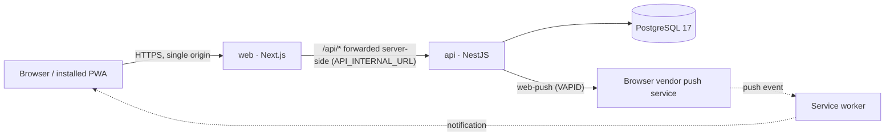
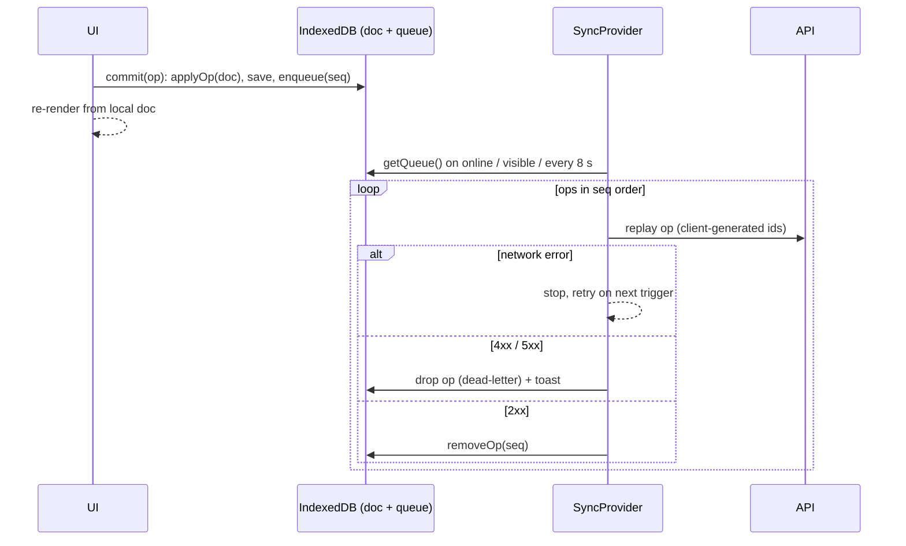

# BOX iT

Mobile-first PWA for logging strength and cardio training set by set, built for people who train with a phone in hand and unreliable gym connectivity.

Repository: [github.com/rodrigoVilla11/boxit](https://github.com/rodrigoVilla11/boxit)

## Why it exists

I wanted a workout logger that behaves like a native app on a phone and does not lose data when the gym basement has no signal. The tools I had tried either needed a connection for every tap, were desktop-first, or locked training history behind a subscription. BOX iT is my answer: a self-hosted, installable web app that tracks live workouts offline, plans training weeks, and keeps records and progress over time.

It runs in production on a self-hosted VPS (Docker, Easypanel) and I use it for my own training. UI copy is in Spanish (es-AR); code, schema and API are in English.

## Features

- **Live workout logging that works offline.** Every tap is applied locally (IndexedDB), queued, and replayed to the API when the connection returns. Set types (normal, warm-up, drop, to failure), RPE and notes per set, supersets, drag-to-reorder, a persistent rest timer with wake lock and audio cue, a plate calculator, and the previous session of each exercise as reference.
- **Routines and an exercise library.** Routines with target sets, rep ranges, weight and rest per exercise; prebuilt templates (Push/Pull/Legs, Upper/Lower, Full Body); start, repeat, or swap exercises mid-workout. Library = a base seed plus ~700 exercises from the [wrkout](https://github.com/wrkout/exercises.json) dataset translated to Spanish, plus per-user custom exercises (an admin role edits the global ones).
- **Cardio activities with structured intervals** (`8 × 400 m, 90 s rest`), pace per sport (min/km, min/100 m, /500 m, km/h), and reusable cardio prescriptions.
- **Weekly plans and a dated calendar.** A cyclic weekly plan (one active per user) plus absolute-date programs (e.g. a multi-week swim block generated from a template), week duplication, and per-day completion tracking.
- **Progress analytics.** Personal records per exercise (top weight, estimated 1RM, set volume, reps), a muscle map weighted by primary/secondary muscles, weekly volume series per muscle, exercise history, calendar heatmap and streak, bodyweight/body-fat trend, cardio distance and pace.
- **Push reminders and data ownership.** Web Push "today's session" and inactivity reminders sent at the user's local hour; JSON/CSV export, JSON import, and a shareable workout summary rendered as an image.

## Architecture

pnpm monorepo with two deployable packages:

```
api/    NestJS 11 + Prisma 6 → PostgreSQL 17    REST under /api, JWT cookies, cron jobs, Web Push
web/    Next.js 15 (App Router) + React 19 PWA   UI, service worker, IndexedDB queue, /api proxy
nginx/  reverse proxy for the Compose-based deploy (not used with Easypanel/Traefik)
```

The API is organised as one Nest module per aggregate: `auth`, `users`, `exercises`, `routines`, `workouts`, `activities`, `cardio-routines`, `plans` (weekly plan), `schedule` (calendar and programs), `bodyweight`, `push`, `tasks` (cron). Every route is behind `JwtAuthGuard`; services scope every query by `userId` and answer 404 on foreign ids, so a foreign record is indistinguishable from a missing one. DTOs are validated by a global `ValidationPipe` (`whitelist` + `forbidNonWhitelisted`), and the process refuses to boot if a required env var is missing.

The web app has two route groups, `(auth)` and `(app)`; `(app)/layout.tsx` stacks the client providers (toasts, units, preferences, rest timer, sync). `web/src/lib/*` wraps the API one file per resource; `web/src/lib/offline/*` holds the local-first store for the active workout.

Production topology:



Only `web` is exposed. The browser never talks to the API host directly: a Next.js route handler (`web/src/app/api/[...path]/route.ts`) forwards `/api/*` to the API's internal hostname and re-emits `Set-Cookie` headers one by one, so session cookies belong to the single public origin. The API container runs `prisma migrate deploy` before starting the server, so a deploy that includes a new migration needs no manual step.

## Stack

Backend: Node 22, NestJS 11, Prisma 6, PostgreSQL 17, class-validator/class-transformer, Joi (env validation), @nestjs/jwt + bcryptjs, @nestjs/throttler, @nestjs/schedule, helmet, web-push.

Frontend: Next.js 15 (App Router, standalone output for Docker), React 19, TypeScript 5, Tailwind CSS 3, Serwist (service worker, precache, offline shell, push handlers), idb (IndexedDB), @dnd-kit (drag and drop), lucide-react. Charts are hand-written SVG, no charting library.

Infra: pnpm workspaces, multi-stage Dockerfiles (`pnpm deploy --prod` for the API, Next standalone for the web), Docker Compose for local Postgres and for a full self-hosted stack with Nginx, Easypanel (Traefik, automatic TLS) as the deployment target.

Testing and checks: Jest + ts-jest for the pure calculation module; `tsc --noEmit` as the lint step in both packages.

## Technical decisions

### 1. Offline-first live workout: an operation queue with idempotent replay

**Problem.** During a workout the phone constantly drops connectivity. Every set has to be saved instantly, and nothing may be lost or duplicated when the network comes back, even if the app was closed mid-session.

**Solution.** The active workout is a local-first document. Each user action becomes an `Op` (`addSet`, `updateSet`, `reorderSets`, `finish`, …) that is (1) applied to the local document by a pure reducer ([reducers.ts](web/src/lib/offline/reducers.ts)) that mirrors the server's rules, (2) persisted to IndexedDB, and (3) appended to a queue store with an auto-increment sequence. `commit()` in [active-store.ts](web/src/lib/offline/active-store.ts) serialises those three steps through a promise chain so concurrent taps cannot interleave a load → apply → save cycle. A `SyncProvider` drains the queue in order on `online`, `visibilitychange` and an 8-second interval.

Replay safety comes from client-generated UUIDs: the workout, each workout exercise and each set receive their id on the client, and the API's create endpoints treat an existing id as a no-op ([workouts.service.ts](api/src/workouts/workouts.service.ts): `create`, `addExercise`, `addSet`). Replaying an op twice cannot create duplicates. Consecutive `updateSet` ops on the same set are collapsed before sending (last write wins), which is what a stepper tapped ten times offline produces.



**Trade-offs.** The server stays the source of truth for totals and history; the client only owns the *active* workout. Hydration prefers the local document and fetches the server's active workout only when the local queue is empty — otherwise it could resurrect a workout that was finished offline but not yet synced. Cardio activities, bodyweight and plans are plain online CRUD: extending the queue to data that is not entered mid-set was not worth the extra surface. A server-rejected op is dropped with a toast rather than blocking the queue forever; the alternative (a stuck sync with no way out) is worse for a single user.

### 2. Cookie sessions across two services behind one origin

**Problem.** Sessions must survive a PWA restart, keep tokens out of JavaScript, and work with `SameSite` cookies — while the web and API run as separate containers, and the hosting platform (Easypanel) cannot route `/api` of one domain to a second service.

**Solution.** The API issues a short-lived access JWT (15 min) and a refresh JWT (7 days) as `httpOnly`, `SameSite=Lax` cookies. Refresh tokens rotate on every use: each carries a `jti`, and only its SHA-256 hash is stored in `RefreshToken`. Presenting an already-revoked token is treated as reuse and revokes every session of that user ([auth.service.ts](api/src/auth/auth.service.ts)). A daily cron purges expired and revoked rows. The browser client ([api-client.ts](web/src/lib/api-client.ts)) retries once after a 401 with a single-flight refresh, so a burst of parallel requests triggers one refresh rather than N.

To keep the cookies first-party without a path-based router, the Next.js server proxies `/api/*` to the API's internal hostname, read at runtime from `API_INTERNAL_URL` (never baked into the client bundle). The Next middleware only checks for the presence of the refresh cookie to redirect between `/login` and the app; validation happens in the API on every request.

**Trade-offs.** One extra hop through Node for every API call, and a proxy that has to stream bodies and cookies correctly (it strips hop-by-hop headers and forwards `Set-Cookie` individually). In exchange there is no CORS, no cross-subdomain cookie configuration, and the API never needs a public hostname. Rate limiting (120 req/min per IP, 10/min on auth endpoints) depends on `trust proxy` to see the real client address.

### 3. One rule set for volume and records, and reordering under a unique constraint

**Problem.** Whether a set "counts" is easy to get subtly inconsistent: warm-ups should not add volume, drop sets should not set records, and the live totals shown in the UI must match what the server persists at finish.

**Solution.** [workouts.calc.ts](api/src/workouts/workouts.calc.ts) is a dependency-free module with the business rules (volume = completed non-warm-up sets; record-eligible = normal or to-failure; Epley 1RM; duration) and is the unit-tested core of the API. The web mirrors `isVolumeSet`/`isPrEligible` in [lib/workouts.ts](web/src/lib/workouts.ts) for live totals and PR highlighting; the server recomputes totals on `finish` and on import, so persisted values never depend on the client.

Reordering exercises or sets has to respect the unique constraints `[workoutId, order]` and `[workoutExerciseId, order]`. A naive renumber collides halfway through, so `reorderExercises`/`reorderSets` first verify that the submitted id list is exactly the existing set, then run a two-phase update inside one transaction: every row to a negative temporary order, then to `1..n`.

**Trade-off.** The calc rules live in two packages instead of a shared workspace package. With only two consumers the duplication is cheaper than a third package in the build; a shared package is the next step if another consumer appears.

### 4. Calendar days and local-time reminders without a timezone column

**Problem.** Scheduled sessions and birth dates are calendar days, not instants; stored as timestamps they shift by a day whenever the user's timezone differs from the server's. Push reminders have to fire at "19:00 for the user", but the server runs in UTC and users never pick a timezone.

**Solution.** Date-only values (`ScheduledSession.date`, `User.birthDate`) are normalised to **noon UTC**, so offsets up to ±12 h cannot move the day, and week arithmetic in [schedule.service.ts](api/src/schedule/schedule.service.ts) uses `setUTCDate`, which is immune to DST. For reminders, the web stores the browser's `getTimezoneOffset()` on the profile when the user enables notifications (`User.timezoneOffsetMin`); an hourly cron ([reminders.service.ts](api/src/tasks/reminders.service.ts)) derives each user's local hour and weekday from that offset and sends "today: Push + 5 km" (from the active weekly plan plus the calendar) or an inactivity nudge. Push subscriptions that answer 404/410 are deleted on the spot.

**Trade-off.** An offset snapshot is not an IANA timezone: a user who crosses a DST change without reopening notification settings gets reminders one hour off until the next update. Acceptable for a personal instance; storing a real timezone is the fix.

## Local setup

Prerequisites: Node 20+ (Docker images use 22), pnpm 11 (`corepack enable`), Docker with Compose (only for Postgres).

```bash
cp .env.example .env               # Postgres for docker-compose
cp .env.example api/.env           # NestJS / Prisma
cp web/.env.example web/.env.local # Next.js

pnpm install
pnpm dev:db          # Postgres 17 in Docker
pnpm db:migrate      # prisma migrate dev
pnpm db:seed         # base exercise library
pnpm db:seed:wrkout  # optional: ~700 extra exercises (idempotent upsert)

pnpm dev:api         # http://localhost:3001/api
pnpm dev:web         # http://localhost:3000
```

Web Push keys are required by env validation even in development: run `pnpm --filter @box-it/api exec web-push generate-vapid-keys`, put the pair in `api/.env`, and the public key also in `web/.env.local`.

Environment variables (names only; templates in `.env.example` and `web/.env.example`):

| Scope | Variables |
| --- | --- |
| Postgres (Compose) | `POSTGRES_USER`, `POSTGRES_PASSWORD`, `POSTGRES_DB`, `POSTGRES_PORT` |
| API | `DATABASE_URL`, `API_PORT`, `CORS_ORIGIN`, `JWT_SECRET`, `JWT_REFRESH_SECRET`, `JWT_ACCESS_TTL`, `JWT_REFRESH_TTL`, `ADMIN_EMAILS`, `VAPID_PUBLIC_KEY`, `VAPID_PRIVATE_KEY`, `VAPID_SUBJECT` |
| Web, build time | `NEXT_PUBLIC_API_URL` (empty in production: same-origin `/api`), `NEXT_PUBLIC_VAPID_PUBLIC_KEY` |
| Web, runtime | `API_INTERNAL_URL` |

Other commands: `pnpm lint` (tsc in both packages), `pnpm --filter @box-it/api test` (Jest), `pnpm build`.

Production: `docker compose -f docker-compose.prod.yml up -d --build` starts Postgres, API, web and Nginx. The Easypanel variant (three services, web-only public domain, TLS via Traefik) and the seed-in-container steps are documented in [DEPLOY.md](DEPLOY.md) (Spanish).

## Project status

In production on a self-hosted instance and under active development (20 Prisma migrations since July 2026). Single-tenant by design: one deployment, per-user accounts, an admin role for the global exercise library.

Known gaps, roughly in the order they would matter to a second user:

- **Thin automated test coverage.** Only the calculation module has unit tests. The API and the offline flow were verified with ad-hoc end-to-end scripts (cookie jar over `fetch`, headless Chrome over CDP) that were never checked in; a committed e2e suite is the first thing I would add.
- **No password recovery or email verification.** No mail provider is wired in. Fine for a self-hosted instance; not fine for public sign-ups.
- **Offline scope is the active workout only.** History, progress and cardio need a connection, and server-rejected ops are dropped with a toast rather than surfaced for manual retry.
- **Reminders use a timezone offset snapshot**, not an IANA zone (see decision 4).
- **Spanish-only UI**, with strings inline rather than behind an i18n layer.
- **In-memory rate limiting** (`@nestjs/throttler` default store), so limits are per API instance.
